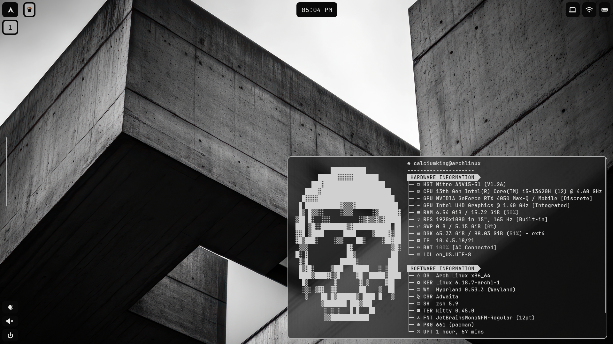
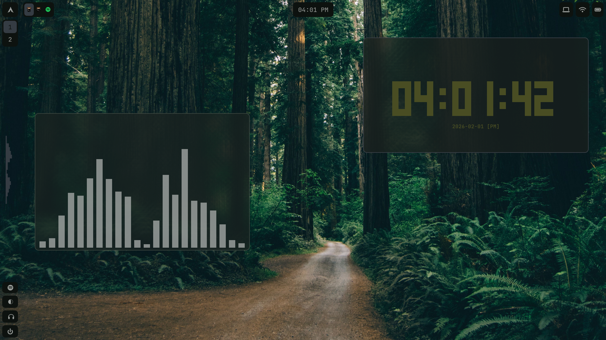
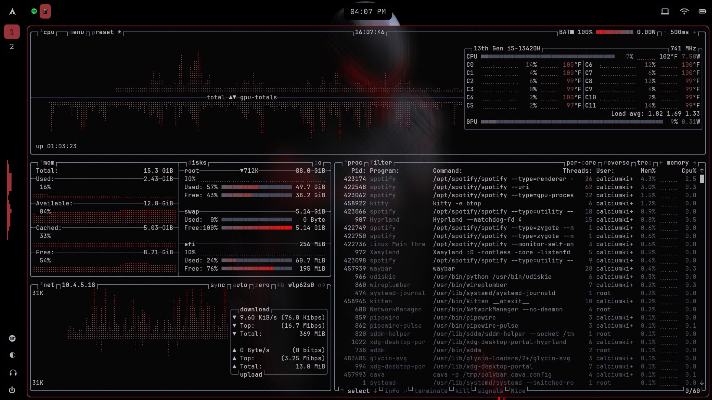
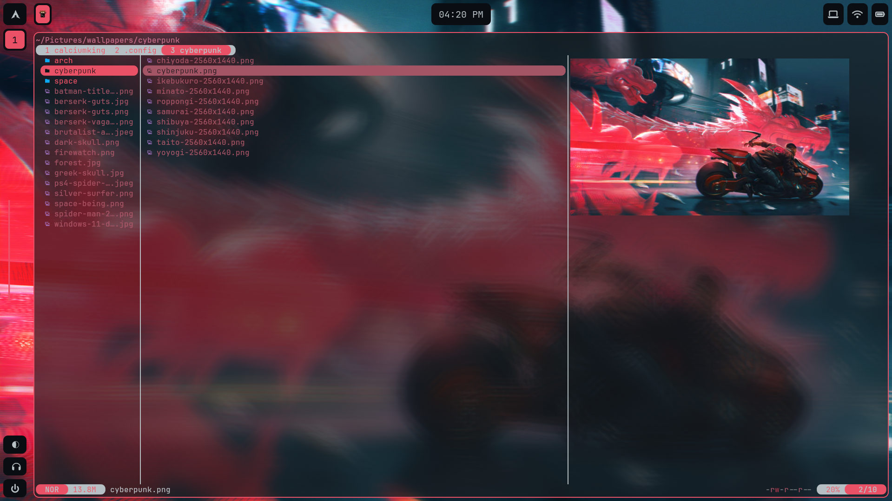
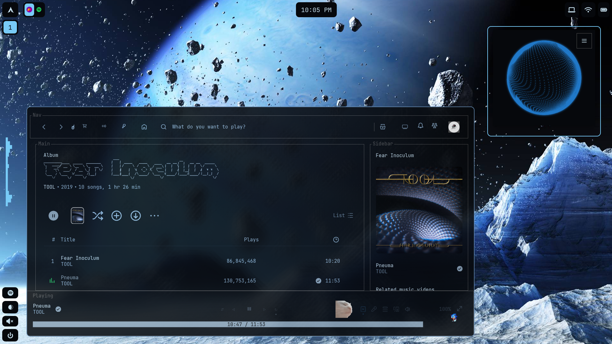
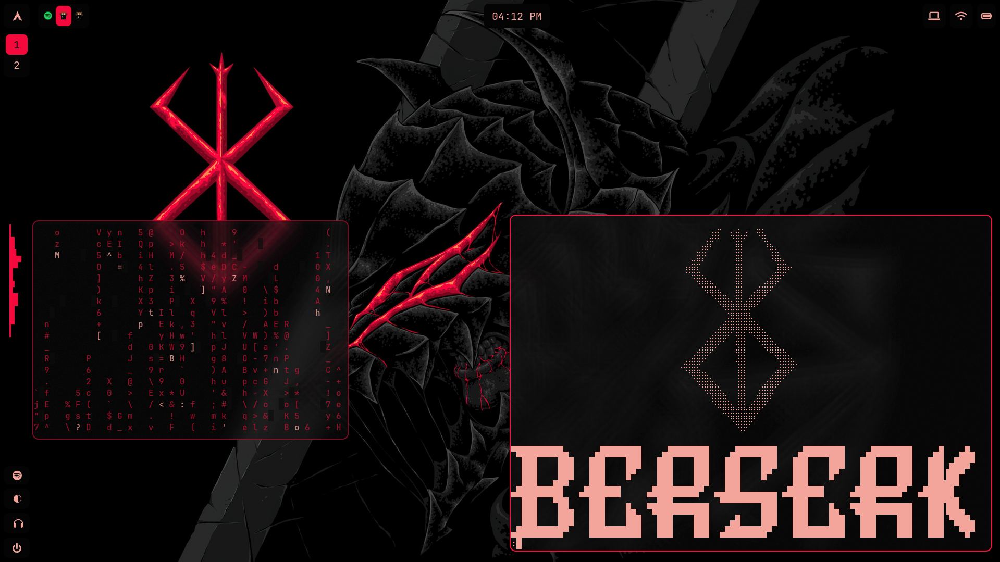
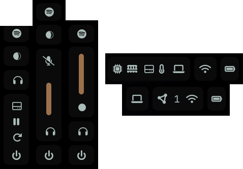
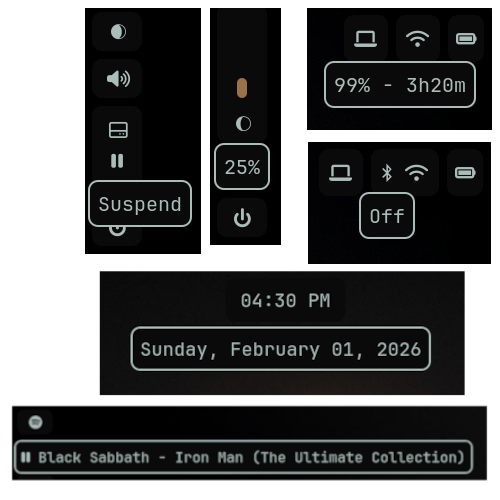

# Arch Linux .Dotfiles

> [!NOTE]
> Dynamic Color Minimalist Design System
> Daily driver on Arch + Hyprland, theme colors generated dynamically based on wallpaper
### [Installation Guide](INSTALL.md)
---
### What's Inside
- **Unified aesthetics** - Dynamically assigned color schemes generated by **Py-Wal**
- **Wallpaper collection** - A collection of high-resolution wallpapers that generate appealing color schemes
- **Minimalist Design** - This **Hyprland** + **Waybar** setup was specifically designed to be minimal without sacrificing functionality
- **Extensive Documentation** - Step-by-step guides with explanations and examples to provide a deep understanding, ensuring that further customization can be done with ease

### Showcase

	System information and ascii art (fastfetch) using wallpaper color scheme

	Terminal applications (cava, tty-clock) using forest wallpaper color scheme

	Resource monitor/task manager (btop) using spider-man 2099 wallpaper color scheme

	File manager (yazi) using cyberpunk wallpaper color scheme

Spotify client (spicetify) using space wallpaper color scheme

	Terminal applications (cmatrix, fastfetch) using Berserk wallpaper color scheme

	Certain menus expand on hover, allowing for lots of menus and functionality without losing space

	Most modules have tool-tips that display more information on hover

### How It Works
After running **Py-Wal** using the `wal -i "/path/to/wallpaper.ext"` command, or changing your wallpaper with software supporting a *post-command* such as **waypaper**, a singular color pallet is dynamically created, and a plethora of style files are generated in `~/.cache/wal/`, those themes are then referenced in various sub-folders within `~/.config/` using symbolic links. After enabling the custom theme within an application, the application will have an appealing color scheme that matches your wallpaper. With the necessary configuration and unique personal customization, all applications will update their theme on wallpaper change.

### How To Install
It is highly recommended to follow the [Installation Guide](INSTALL.md) for step-by-step setup and troubleshooting. Please read all instructions and have an understanding of commands before executing them on your machine to prevent possible damage.

### Related Projects
- [Calciums-Theme](https://github.com/CalciumKing/Calciums-Theme) - A sleek, maroon-toned variant of system24 - for discord clients with theme support
